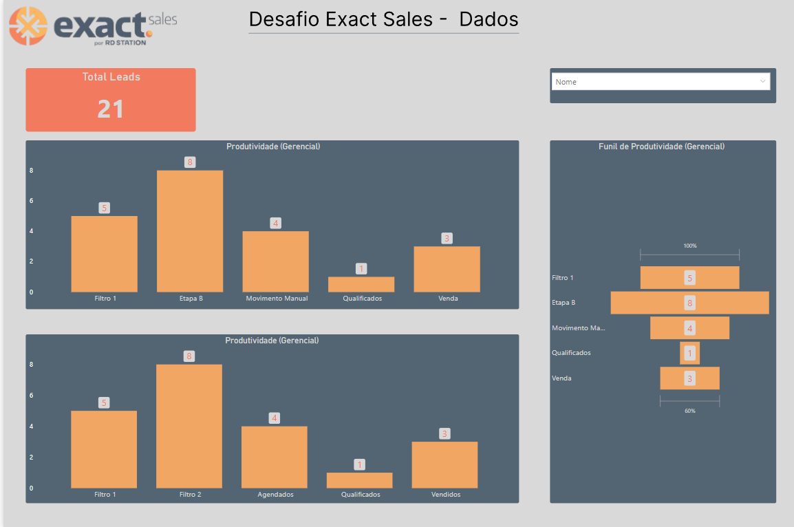
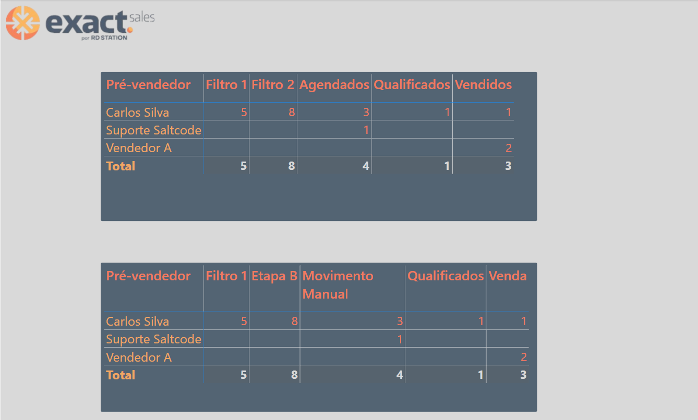
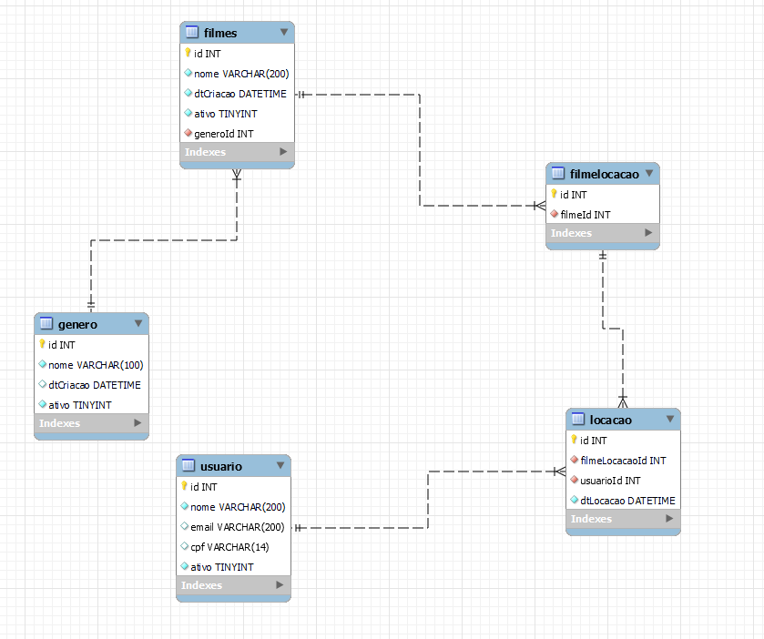
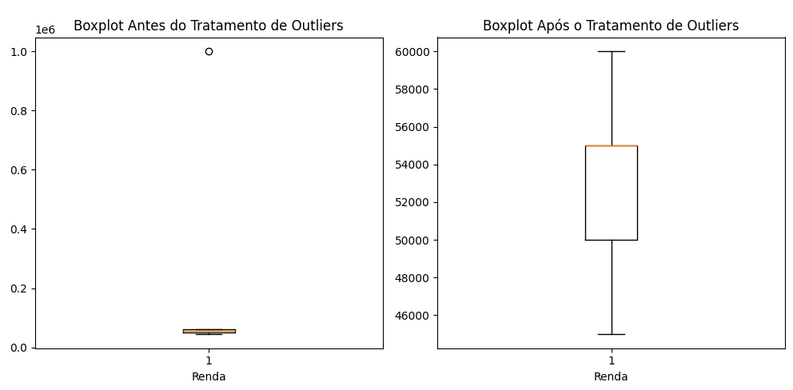
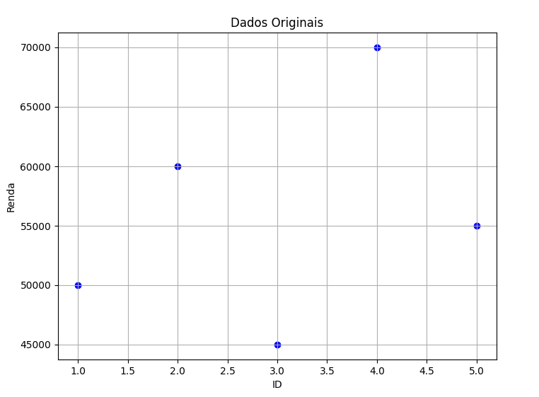
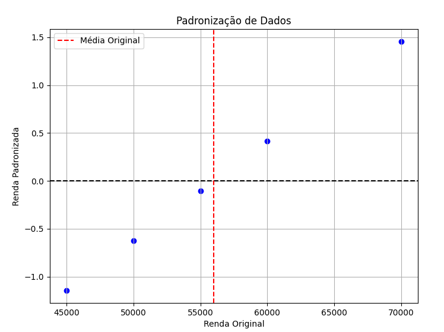
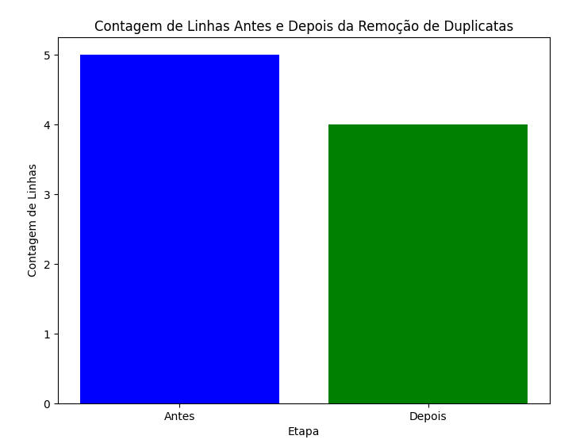

# Etapa 1

## Os indicadores se encontram no arquivo PBIX no repositório caso precisem.
* Referente ao desafio, os dados informados via API, foram acessados da seguinte forma:
```python
import requests as rq
import pandas as pd

def get_data(endpoint, token):

    api = f"{endpoint}/QualificationHistories"
    headers = {
        "Content-Type": "application/json",
        "token_exact": f"{token}"
    }

    resp = rq.get(api, headers=headers)
    data = resp.json()

    values = data.get("value", [])
    
    names = []
    for value in values:
        user_action = value.get("userAction", {})
        name = user_action.get("name")
        last_name = user_action.get("lastName")
        full_name = f"{name} {last_name}" if name and last_name else None
        names.append(full_name)
    
    df = pd.DataFrame(values)
    df["name_lastname"] = names

    return df


if __name__ == "__main__":

    endpoint = "https://api.exactspotter.com/v3"
    token = "e4b1da77-06aa-4777-a594-cc5bb6e549c4"

    df = get_data(endpoint, token)

    print(df)

```
* Script simples para acessar o endpoint da API, ao analisar os dados e o indicador passado como referência, notei que os dados não estavam condizentes com o exemplo, os Stages não batiam com o indicador.
    -  Outra coisa que notei logo inicialmente é que o indicador é um Funil em um gráfico de colunas.
    - Sendo apenas uma contagem do Total de Leads, separados por etapa.
        - acontece que com os dados fornecidos, é impossível chegar no resultado esperado sem manipular os dados conforme executei, visto que na primeira etapa Filtro 1, temos 5 leads, logo na etapa seguinte, temos 8, se é um Funil, como temos 5 e passaram 8 para próxima etapa?
        - A ordem dos Stages considerei como Filtro 1 -> Etapa B -> Movimento Manual -> Qualificados e Venda
        - Em outro indicador, renomeei alguns do Stages, para ficarem de acordo com exemplo informado
            - Filtro 1 -> Filtro B = Filtro 2, Movimento manual = Agendados -> Qualificados -> Venda = Vendidos
        - Não sei se a base fornecida para construção veio faltando informação, mas com os dados fornecidos via API, esse foi o resultado alcançado.
    * Usei POWER BI como ferramente de construção dos indicadores.
    * Python como Direct Data Source.

* Indicador 1

* Indicador 2


---

# Etapa 2
## SQL Desafio
```sql
##criação das tabelas MySQL:

CREATE TABLE genero (
	id int PRIMARY KEY auto_increment,
    nome varchar(100) not null,
    dtCriacao datetime null,
    ativo tinyint not null
);

CREATE TABLE filmes (
	id int primary key auto_increment,
    nome varchar(200) not null,
    dtCriacao datetime not null,
    ativo tinyint not null,
    generoId int not null,
    foreign key (generoId) references genero(id)
);

CREATE TABLE usuario (
	id int primary key auto_increment,
    nome varchar(200) not null,
    email varchar(200),
    cpf varchar(14),
    ativo tinyint not null
);

CREATE TABLE filmelocacao (
	id int primary key auto_increment,
    filmeId int not null,
    foreign key (filmeId) references filmes(id)
);

CREATE TABLE locacao (
	id int primary key auto_increment,
    filmeLocacaoId int not null,
    usuarioId int not null,
    dtCriacao datetime not null,
    foreign key (filmeLocacaoId) references filmelocacao(id),
    foreign key (usuarioId) references usuario(id)
);


## INSERTS

INSERT INTO filmes (nome, dtCriacao, ativo, generoId)
SELECT 
    CONCAT('Filme ', n) AS nome,
    NOW() AS dtCriacao,
    1 AS ativo,
    FLOOR(RAND() * 5) + 1 AS generoId
FROM (
    SELECT 1 AS n UNION ALL
    SELECT 2 UNION ALL
    SELECT 3 UNION ALL
    SELECT 4 UNION ALL
    SELECT 5 UNION ALL
    SELECT 6 UNION ALL
    SELECT 7 UNION ALL
    SELECT 8 UNION ALL
    SELECT 9 UNION ALL
    SELECT 10 UNION ALL
    SELECT 11 UNION ALL
    SELECT 12 UNION ALL
    SELECT 13 UNION ALL
    SELECT 14 UNION ALL
    SELECT 15 UNION ALL
    SELECT 16 UNION ALL
    SELECT 17 UNION ALL
    SELECT 18 UNION ALL
    SELECT 19 UNION ALL
    SELECT 20
) AS numbers;

INSERT INTO usuario (nome, email, cpf, ativo)
VALUES 
('Usuário 1', 'usuario1@example.com', '111.111.111-11', 1),
('Usuário 2', 'usuario2@example.com', '222.222.222-22', 1),
('Usuário 3', 'usuario3@example.com', '333.333.333-33', 1),
('Usuário 4', 'usuario4@example.com', '444.444.444-44', 1),
('Usuário 5', 'usuario5@example.com', '555.555.555-55', 1);

INSERT INTO genero (nome, dtCriacao, ativo)
VALUES 
('Ação', NOW(), 1),
('Comédia', NOW(), 1),
('Drama', NOW(), 1),
('Suspense', NOW(), 1),
('Animação', NOW(), 1);


INSERT INTO locacao (filmeLocacaoId, usuarioId, dtLocacao)
SELECT 
    FL.ID AS filmeLocacaoId,
    U.ID AS usuarioId,
    NOW() AS dtLocacao
FROM 
    (SELECT ID FROM filmelocacao ORDER BY RAND() LIMIT 20) FL
CROSS JOIN 
    (SELECT ID FROM usuario ORDER BY RAND() LIMIT 5) U;
	

## SELECTS

SELECT
  F.nome AS 'Filme',
  G.nome AS 'Genero',
  L.dtLocacao,
  U.nome AS 'Usuario',
  U.email
FROM
  locacao L
  JOIN filmelocacao FL ON L.filmeLocacaoId = FL.id
  JOIN filmes F ON FL.filmeId = F.id
  JOIN genero G ON F.generoId = G.id
  JOIN usuario U ON L.usuarioId = U.id
WHERE
  MONTH(L.dtLocacao) = MONTH(NOW())
  AND YEAR(L.dtLocacao) = YEAR(NOW());


SELECT
  U.nome,
  U.cpf
FROM
  usuario U
  JOIN locacao L ON U.ID = L.usuarioId
WHERE
  U.ativo <> 0;


SELECT
  DISTINCT F.ID,
  F.nome,
  U.nome
FROM
  filmes F
  JOIN filmelocacao FL ON F.ID = FL.filmeId
  JOIN locacao L ON FL.ID = L.filmeLocacaoId
  JOIN usuario U ON L.usuarioId = U.ID
WHERE
  U.email LIKE '%a%';


SELECT
  F.nome,
  COUNT(*) AS 'Quantidade de aluguéis'
FROM
  filmes F
  JOIN filmelocacao FL ON F.ID = FL.filmeId
  JOIN locacao L ON FL.ID = L.filmeLocacaoId
GROUP BY
  F.nome
ORDER BY
  COUNT(*) DESC;

```
* Diagrama

---

# Teste Lógico
## Questão 1
[1] Você recebeu um conjunto de dados de clientes da nossa empresa, mas
ele está repleto de valores ausentes e inconsistências. Como você abordaria
esse problema? Descreva pelo menos três técnicas de limpeza e
pré-processamento de dados que você poderia aplicar e explique quando
cada uma delas seria apropriada.

* Tratamento de Outliers:
    - Lida com valores atípicos ou extremos que podem distorcer as análises estatísticas.
    - Um exemplo disso se tivermos uma coluna de idade de clientes e alguns valores estiverem ausentes, poderíamos preencher os valores ausentes com a média da idade dos clientes (claro que isso depende da regra do negócio envolvida e o quanto impacta no resultado final). Ou apenas desconsiderar os valores que estão ausentes/nulos
    ```python
    import numpy as np
    import pandas as pd
    import matplotlib.pyplot as plt

    data = {'ID': [1, 2, 3, 4, 5],
            'Renda': [50000, 60000, 45000, 1000000, 55000]}
    df = pd.DataFrame(data)

    plt.figure(figsize=(10, 5))
    plt.subplot(1, 2, 1)
    plt.boxplot(df['Renda'])
    plt.title('Boxplot Antes do Tratamento de Outliers')
    plt.xlabel('Renda')

    Q1 = df['Renda'].quantile(0.25)
    Q3 = df['Renda'].quantile(0.75)
    IQR = Q3 - Q1
    limite_superior = Q3 + 1.5 * IQR

    df['Renda'] = np.where(df['Renda'] > limite_superior, df['Renda'].median(), df['Renda'])


    plt.subplot(1, 2, 2)
    plt.boxplot(df['Renda'])
    plt.title('Boxplot Após o Tratamento de Outliers')
    plt.xlabel('Renda')

    plt.tight_layout()
    plt.show()

    ```
    


* Padronização de Dados:
    - Envolve em transformar os dados para que estejam em uma escala padrão, o que pode ser útil para algorítimos de aprendizado de máquina que são sensíveis em relação a escala dos dados.
    - Exemplo: padronizar os valores de uma variável numérica subtraindo a média e dividindo pelo desvio padrão.
    ```python
    import pandas as pd
    import matplotlib.pyplot as plt


    data = {'ID': [1, 2, 3, 4, 5],
            'Renda': [50000, 60000, 45000, 70000, 55000]}
    df = pd.DataFrame(data)


    mean_renda = df['Renda'].mean()
    std_renda = df['Renda'].std()


    df['Renda_padronizada'] = (df['Renda'] - mean_renda) / std_renda


    plt.figure(figsize=(8, 6))
    plt.scatter(df['Renda'], df['Renda_padronizada'], color='blue')
    plt.title('Padronização de Dados')
    plt.xlabel('Renda Original')
    plt.ylabel('Renda Padronizada')
    plt.grid(True)
    plt.axhline(y=0, color='black', linestyle='--')
    plt.axvline(x=mean_renda, color='red', linestyle='--', label='Média Original')
    plt.legend()
    plt.show()
    ```
    

* Remoção de Dados Duplicados:
    - Envolve em identificar e remover entradas duplicadas no conjunto de dados.
    - Exemplo, temos uma tabela de clientes onde algumas linhas são duplicadas, podemos remove-las para garantir integridade.
    ```python
    import pandas as pd
    import matplotlib.pyplot as plt

    data = {'ID': [1, 2, 3, 4, 2],
            'Nome': ['Alice', 'Bob', 'Charlie', 'David', 'Bob'],
            'Idade': [25, 30, 35, 40, 30]}
    df = pd.DataFrame(data)

    contagem_antes = len(df)

    df_sem_duplicatas = df.drop_duplicates()

    contagem_depois = len(df_sem_duplicatas)

    plt.figure(figsize=(8, 6))
    plt.bar(['Antes', 'Depois'], [contagem_antes, contagem_depois], color=['blue', 'green'])
    plt.title('Contagem de Linhas Antes e Depois da Remoção de Duplicatas')
    plt.xlabel('Etapa')
    plt.ylabel('Contagem de Linhas')
    plt.show()

    ```
    


# Questão 2
[2] 2 - Nossa empresa deseja prever a taxa de churn (abandono de clientes)
com base em dados históricos de uso do produto. Como você abordaria esse
problema de modelagem preditiva? Descreva o processo que você seguiria,
incluindo a seleção de recursos relevantes, a escolha de um algoritmo de
aprendizado de máquina e a avaliação do desempenho do modelo.

* Primeiro entenderia o problema e os dados a serem utilizados
    - compreenderia o problema de negócio e os dados disponíveis, que incluí entender o que constituí o Churn para empresa, quais os históricos disponíveis(uso dos produtos, demográficos de cliente, suporte ao cliente) e como estão estruturados.
* Limpeza e Pré-processamento de dados
    - Iria realizar limpeza dos dados, tratando valores ausentes, removendo duplicados, variáveis categóricas e a normalização dos dados.
* Selecionar Algorítimo de Aprendizado de Máquina
    - Começaria olhando e escolhendo um algrítimo adequado para o problema em questão, alguns comuns para previsão de churn, são regressão logística, árvore de decisão, floresta aleatória, lift, tudo vai depender da métrica escolhida e qual vai possuir o melhor resultado para atender o problema do negócio.
* Treinamento do Modelo
    - Poderia dividir os dados em conjuntos de treinamento e testes e treinaria o modelo usando conjunto de treinamento, ao andar do treinamento, ajustaria os parâmetros do modelo e poderia usar alguma técnica de validação cruzada.
* Avaliação do modelo.
    - Teria que avaliar o que teve melhor desempenho utilizando algumas métricas para o problema, algumas delas que são comuns, recall, F1-score, curva ROC.

# Questão 3
[3] Após treinar um modelo de previsão de churn, como você avaliaria sua
eficácia? Descreva pelo menos três métricas de avaliação de modelo que
você consideraria relevantes para este caso específico e explique por que
cada uma delas é importante.

* Usaria algumas métricas como:
    - Accuracy, ajuda a validar a proporção das previsões corretas em relação ao total de previsões feitas no modelo.
        - calculado como número de previsões corretas dividido pelo número total de previsões.
        - essa métrica é importante para avaliar o quão bem o modelo está classificando corretamente os clientes, uma alta precisão significa que o modelo ta fazendo previsões precisas.
    - Recall, é uma medida de proporção de instância positivas que foram corretamente previstas.
        - é calculado com número de verdadeiros positivos divido pela soma dos verdadeiros positivos e falsos negativos.
        - a importância é que da para avaliar a capacidade do modelo de identificar corretamente os clientes que realmente darão Churn, alto recall indica que modelo ta capturando maioria dos clientes que estão propensos a churn.
    - f1-score, seria a média entre a precisão e recall.
        - vai ser calculado 2 vezes o produto da precisão e recall dividindo pela soma da precisão e recall.
        - f1 seria uma métrica bastante balanceada onde vai considerar tanto a precisão quanto o recall, quando se tem desequilíbrio nas classes.
        - f1-score seria importante pra avaliar o desempenho global do modelo, vendo tanto a capacidade de prever o churn corretamente e a minimização de falsos positivos.

# Questão 4

[4]4 - Nossa empresa está considerando alterar o preço de sua assinatura
mensal. Como você ajudaria a empresa a tomar essa decisão com base em
dados? Quais são os fatores que você consideraria e como você os analisaria
para determinar o impacto potencial dessa mudança nos negócios?

* Verificar análise dos dados históricos
    - iria coletar e analisar os dados de vendas, incluindo infomrações sobre número de assinantes, receita gerada, churn, comportamente de compra.
    - achar tendência e padrões nos dados, como sazonalidade, mudanãs no número de assinantes em um período, efeito de promoções de preços.
* Poderia Segmentar Clientes
    - dividindo clientes em segmentos usando caracterísitcas demográficas, comportamentais e de consumo.
    - verificando comporatemento em cada segmento em relação aos preços, disposição de pagar, reações de mudanças de preços anteriores.
* Analisar a Concorrência
    - valiação de preços que são usados nas concorrências e como se comparam aos preços da empresa atualmente
* Teste A/B
    - experimento de preços, pra avaliar o impacto real das mudanças de preço em um grupo de clientes.

## Referente as questões, todo conteúdo referente a churn, aprendizado de máquina descrito, já estudei teoricamente e atualmente estou aplicando a maioria dos conceitos que informei na prática em um curso de longa duração de Data Science da ASN.rocks